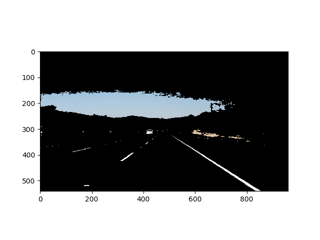

# **Finding Lane Lines on the Road** 

## Writeup 

---

**Finding Lane Lines on the Road**

The goals / steps of this project are the following:
* Make a pipeline that finds lane lines on the road
* Reflect on your work in a written report

[//]: # (Image References)

[solidWhiteCurve]: ./test_image_output/solidWhiteCurve.jpg
[solidWhiteRight]: ./test_image_output/solidWhiteRight.jpg
[solidYellowCurve]: ./test_image_output/solidYellowCurve.jpg
[solidYellowCurve2]: ./test_image_output/solidYellowCurve2.jpg
[solidYellowLeft]: ./test_image_output/solidYellowLeft.jpg
[whiteCarLaneSwitch]: ./test_image_output/whiteCarLaneSwitch.jpg

---

### Reflection

### 1. Description of the pipeline.

#### Filtering colors
- To detect color HSL space works better than RGB. If we want to detect yellow color, variations in lighting conditions can change all the 3, (R,G,B) values. In HSL space Hue and Saturation of Yellow color show very less variations and only Light is affected, thus making it easier to track yellow color.Using this concept a white and yellow color filter is created for the image in the HSL space and the original RGB image is masked with these filters. This enhances the white and yellow lines. 
- The reference talks about HSV, the same can be applied to HSL. 
Ref:http://opencv-python-tutroals.readthedocs.io/en/latest/py_tutorials/py_imgproc/py_colorspaces/py_colorspaces.html

#### Detecting Edges
- To detect edges Canny edge detector is used. The image obtained in the previous step is first converted to grayscale and blurred using gaussian filter. This acts as Low pass filter and removes all small edges and corners. A dynamically adjusting Canny edge detector is used by calculating median of the image and setting the threshold as +- 10% of the median value.
Ref:https://www.pyimagesearch.com/2015/04/06/zero-parameter-automatic-canny-edge-detection-with-python-and-opencv/

#### Selecting ROI
- The whole image is filled with all sorts of lines and computationally difficult to find which ones are the lane lines. To solve this problem, an estimated region of interest is choosen, the edges within this ROI belong to lane lines.

#### Drawing lines
- Once we get edges, we need to draw lines. For this HoughLines is used which returns a list of lines in the form of (x1,y1,x2,y2). These lines are raw and needs to be processed to form a solid curve

#### Interpolating and fitting a curve
- The road is not always straight and curves on turns. Thus a quadratic curve is fitted in the set of points obtained from hough lines using numpy polyfit function which returns [a,b,c], where $y=a*x^2+b*x+c$.

#### Averaging curves using Moving Average Filter
- For every image the [a,b,c] values fluctuate due to outliers. To avoid this a moving average filter is used. thus a smooth quadratic curve is obtained with less fluctuations.

#### Superimposing on original image
- The above image consists of lines and cropped ROI. This is superimposed on the original image to form the result image.

### 2. Potential shortcomings with this pipeline
- This model fits a quadratic polynomial and can only work on straight and curved roads but will fail at intersections.
- There are many manually tunable parameters which needs to be automated by some kind of calibration process.A standard method in Computer vision is checkerboard calibration.

### 3. Possible improvements to this pipeline
- A mathematical model like $y=a*x^2+b*x+c$ for lane lines can be trained on good labeled dataset and a probabilistic approach can be used to fit the lane minimising the standard deviation. This could help when the lane lines are ocluded by cars in front and lanes are not clearly visible.
- The calibration process can run online to get the maximum confidence for the lane fit. this can be done by optimising the parameters in parameter space using non-convex optimization techniques. 
